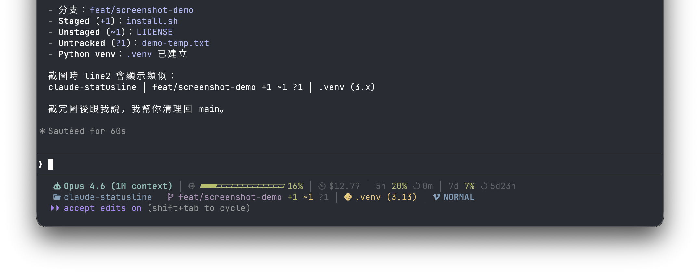

# Claude Code Status Line

A two-line status line for [Claude Code](https://docs.anthropic.com/en/docs/claude-code). Shows what matters, skips what doesn't.



**English** | [繁體中文](README.zh-TW.md)

## Installation

```sh
curl -fsSL https://raw.githubusercontent.com/tzengyuxio/claude-statusline/main/install.sh | bash
```

Then restart Claude Code. Requires **bash** 4.0+, **jq**, **git**, and a [Nerd Font](https://www.nerdfonts.com/).

<details>
<summary>Manual installation</summary>

**1. Download the script:**

```sh
curl -o ~/.claude/statusline-command.sh \
  https://raw.githubusercontent.com/tzengyuxio/claude-statusline/main/statusline-command.sh
chmod +x ~/.claude/statusline-command.sh
```

**2. Add to `~/.claude/settings.json`:**

```json
{
  "statusLine": {
    "type": "command",
    "command": "~/.claude/statusline-command.sh",
    "padding": 1
  }
}
```

**3. Restart Claude Code.**

</details>

## What You See

### Line 1 — AI Status & Usage

```
Model │ Context Bar 28% │ $0.42 │ 5h 45% ↺ 4h27m │ 7d 12% ↺ 5d2h
```

Model name, context progress bar (16 segments), session cost, 5h/7d API quota with reset countdown. A red alert badge appears at 90%+ context usage.

### Line 2 — Workspace

```
my-project │ main +2 ~1 ?3 │ .venv (3.12) │ NORMAL
```

Directory, git branch + file counts, Python venv (when detected), vim mode (when enabled).

All percentages use traffic-light coloring: green (0–49%), yellow (50–79%), red (80%+).

## Design Philosophy

- **Useful first, pretty second** — if it doesn't affect your next action, it's not on the status line
- **Quiet by default** — optional segments (venv, vim mode) only show up when relevant
- **Glanceable** — two lines, color-coded, no reading required
- **Fast** — ~30ms render via single `jq` pass, single `git status`, and background-cached API calls

## Customization

Edit `statusline-command.sh`:

- `BAR_SEGMENTS` — progress bar segments (default: 16)
- `CACHE_TTL` — API quota refresh interval in seconds (default: 60)
- `pct_color()` — color thresholds
- `ICON_*` — swap with your preferred Nerd Font glyphs

## Credits

Inspired by [claude-powerline](https://github.com/Owloops/claude-powerline), [steipete](https://gist.github.com/steipete/8396e512171d31e934f0013e5651691e), [keremkesgin](https://gist.github.com/keremkesgin/1d2cb7278d3d7a0f0202cfa343162b1d), [coffeewhistle](https://gist.github.com/coffeewhistle/8acee2d946a0c3e90a542e0f3930a4e3), and [Freek Van der Herten](https://freek.dev/3028-adding-a-custom-status-line-to-claude-code).

## License

MIT
